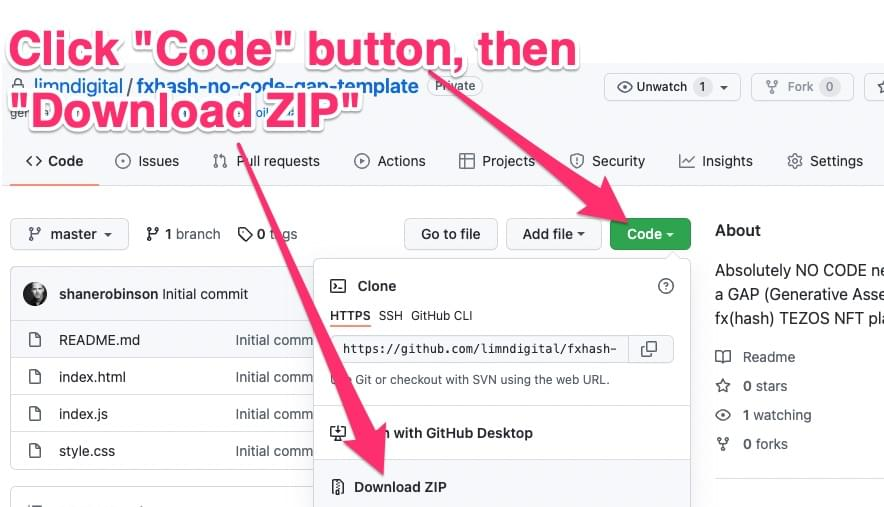
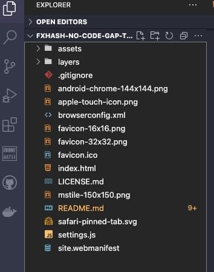
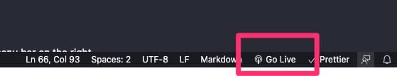

# fx(hash) NO-CODE GAP\* Template

**Licensed under Creative Commons Attribution-ShareAlike 4.0 International Public License.**  
_Please see [License.md](./LICENSE.md "License") for details._  

---

> 🔥 If you use this template, please let me know on [Twitter @LimnDigital](https://twitter.com/limndigital) and you can also add your fx(hash) GAP to the [Show and tell](https://github.com/limndigital/fxhash-no-code-gap-template/discussions/categories/show-and-tell) section of this repo!

---

# What is this?

This is the absolute simplest template to create a GAP\* on [fx(hash)](https://fxhash.xyz).

## Features

🔥 <strong>No Node.js needed!</strong> _(Do you know what *Node.js* is? No? Good 'cuase you don't need it!)_  
🔥 <strong>No Code needed!</strong>  
🔥 <strong>No Features or Rarity in this version to keep it super simple! _(coming in future versions)_</strong>  
🔥 <strong>No complex folder or file naming conventions!</strong>  
🔥 <strong>FavIcons included!</strong>  
🔥 <strong>Customize your Project Title, Artist Name, and console.log() messages!</strong>  
🔥 <strong>Test on your local machine with auto-browser refresh!</strong>

## Easy as 1, 2, 3...

1. Create as many _"Trait Layers"_ as you want.
2. Create as many _"Trait Images"_ in each Layer as you want.
3. Change the Title, Artist Name, Layer Count, Trait Count in the `settings.js` file.
4. Test with a local server _([instructions below](#gap-setup))_ to make sure everything works.
5. **IMPORTANT:** You can delete the `readme` folder and this `README.md` file to save space in your final ZIP. All the other files and folders you **NEED TO KEEP** for your GAP to work correctly.
6. ZIP _(compress)_ all the files & folders **INSIDE** the Project folder. _(NOT the Project folder itself)_
7. Upload the .ZIP file to the **fx(hash) Sandbox** for testing.
8. Pubilsh your new **GAP** on fx(hash)! _([step-by-step screenshot instructions in the Discussions section above.](https://github.com/limndigital/fxhash-no-code-gap-template/discussions/1))_

---

## \*What is a GAP?

GAP stands for **Generative Assembly Project** and it's term coined by [@LimnDigital](https://twitter.com/limndigital "@LimnDigital on Twitter") to describe fx(hash) Projects that randomly "**assemble**" layers of images _(traits)_ to form new, random Artworks. This is in technical contrast to _"pure code"_ Generative Tokens that create patterns, shapes, and images.

## Isn't that just a PfP?

A GAP _can_ be a PfP _(Profile Pic)_. But it doesn't have to be. The image layers could be hills, trees, and skies that assemble to form a **Landscape GAP**. It could be multiple layers of flowers that assemble to form a **Garden GAP**.

By broadly labeling these templates as just a _PfP_ dramatically limits their use and understanding by Artists who may have little or no programming skills.

---

# Let's dive in!

## Requirements

- [Visual Studio Code (VSC) FREE](https://code.visualstudio.com/ "VS Code") : The top code editor used by millions of coders and companies world wide.
- Local HTTP server _(we will add to VSC)_ so you can test your GAP on your computer in real time so you don't have to upload to fx(hash) Sandbox just to test while you're adding images.

## GAP Setup

1. Click the "Code" button above and select "Download ZIP".
   1. That will download a file named `fxhash-no-code-gap-template-main.zip`
2. You should put this ZIP in a safe place on your computer, like a dedicated Dropbox folder. So if your computer falls off a truck, is stolen, etc., your GAP will always be safe and available in your Dropbox.
3. Unzip _(double click)_ the `fxhash-no-code-gap-template-main.zip` file.
   1. It will create a folder `fxhash-no-code-gap-template-main`
   2. You can rename this folder anything you want...The Title of your GAP would be a good idea to name it.
4. [Download](https://code.visualstudio.com/ "VS Code"), install, and open VSC.
5. With VSC open, it will be in your Dock:
   1. Drag the folder created in step 3 to VSC in your Dock.
   2. This will open your new GAP in VSC. You always NEED to open the Folder, NOT just a file.
6. Your VSC sidebar should look like this:

7. Now we're going to install a **Web Server** right inside VSC!
8. Click the **"Extensions"** tab and the _File Explorer_ will be replaced with the _Extensions_ viewer. Here you can install Extensions to extend the functionality of VSC.
9. In the _"Search"_ bar at the top, enter _"live server"_ and it should be the first choice.
   1. Yours will have an _"Install"_ button like all the other extensions. Click Install.
   2. Details about the Live Server extension: https://marketplace.visualstudio.com/items?itemName=ritwickdey.LiveServer

10 When completed, you should have a "**Go Live**" button in VSC's bottom menu bar on the right.

1.  Click "**Go Live**" and if you've followed the instructions, your default browser will open to display this demo GAP Artworks:

12. If you refresh your Browser, a new GAP will be created, just like on fx(hash).
13. If you update the values in the `settings.js` file and save them, your Browser will automatically refresh.

## Problems?

If you have problems getting your VSC and GAP setup to run correctly, please post an **Issue** on Github in this repo's Issue section: https://github.com/limndigital/fxhash-no-code-gap-template/issues

> This is free software and provided "_AS IS_" and I can't promise speedy support, but I will do my best to help people get their GAPs running at least through this Setup stage.

---

# Customize Your GAP

Now that you have a working GAP, it's time to customize with your own Layers & Artwork _(traits)_ and Settings.

## Layers Folder

1. Take a look at the `/layers` folder and the folders inside. Those are you **"Trait Layers"** and you can have as many as you want.
2. The "0" folder is your **Backgrounds** and the files in there should all be JPGs.
3. Because the **Backgrounds** dont need transparent areas, make them JPGs and compress them as much as possible.
   1. I use Image Shrinker (https://image-shrinker.com/) and have found it to be the best JPG compressor.
   2. You can also use an online service like TinyJPG (https://tinyjpg.com/) and TinyPNG (https://tinypng.com/)
   3. I use TinyPNG for my PNGs and the $25/year Pro account is VERY MUCH WORTH IT!!
4. Then create your Artwork traits and place them in the appropriate folders. You can has as many Artwork Traits in each Layer as you want. Just make sure to follow the instructions in the `settings.js` file and properly count both your Layers and Artwork Traits in each folder.
   1. If you mess up your Layer counts or Artwork Trait counts the GAP won't work correctly.

## settings.js File

1. Click the `settings.js` file in the VSC File Explorer and read through the comments and update your settings for your project.
2. As mentioned above, the most important settings are the `layerCount` and `traitCount` settings. Get those wrong and your GAP will break.

> PRO TIP: If you really mess up, just throw the entire folder away and download a clean new version from the repo and repeat the above steps. It'll go faster this time because you won't have to install and configure VSC!

---

# Testing your GAP on the fx(hash) Sandbox

When you are done creating and testing all your Artwork, and everything seems to work correctly with your local **Live Server**, it's time to test in the fx(hash) Sandbox.

1. **NOTE:** You have **select all the files and folders _IN_ the project folder and ZIP them. NOT the folder itself.**
   1. Select all the files and folders _(On Mac just press "CMD + A" then right click on any file and select "Compress" from the contextual menu)_
   2. This will create a file named _"Archive.zip"_.

2. **CHECK THE ZIP FILE SIZE! It need to be less than 15MB.** If it's not you have to either compress your images more, or use fewer images.
3. Head to the fx(hash) Sandbox: https://www.fxhash.xyz/sandbox
4. Drag-n-Drop your _"Archive.zip"_ to the black box and click "start tests".

](./readme/vsc6.jpg "Check Archive.zip size")

Your GAP should display your Artworks, change each time you click the _"new hash"_ button and should NOT change when you click the _"retry with same hash"_ button.

# Publish your token

If everything works correctly in the Sandbox, you are ready to Publish your GAP.

Click your Avatar in the top right and select _"mint generative token"_ and go through the 6 steps to publish your GAP.

I've created a _"How To"_ article in the _"Discussion"_ of this repo. It goes through each step with screenshots and can be found here:  
https://github.com/limndigital/fxhash-no-code-gap-template/discussions/1

---

# Lastly...

If this is your first Project on fx(hash) you are not verified and once you publish your project, your project will be locked for 3 hours.

You can find your project [on the "explore locked generators" screen](https://www.fxhash.xyz/explore/locked) with a countdown timer.

---

# From fx(hash) : How do Generative Tokens work

Before diving into the development of your token, we recommend reading the [Guide to mint a Generative Token](https://fxhash.xyz/articles/guide-mint-generative-token) to get some understanding of the process.

This is how Generative Tokens work on fxhash:

- you upload your project to the platform (see next section)
- you mint your project
- when a collector will mint its unique token from your Generative Token, a random hash will be hard-coded in the **fxhash code snippet**
- the token will now have its own `index.html` file, with a **static** hash, ensuring its immutability

The [Guide to mint a Generative Token](https://fxhash.xyz/articles/guide-mint-generative-token) give in-depth details about this process.
